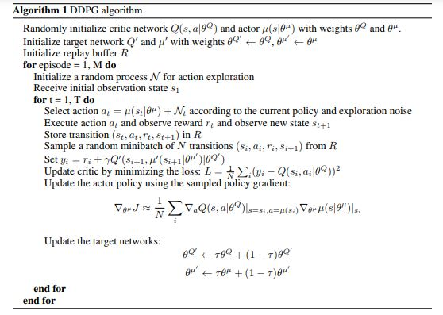

### About the Environment (Option 1 with one Agent)
In this environment, a double-jointed arm can move to target locations. A reward of +0.1 is provided for each step that the agent's hand is in the goal location. Thus, the goal of your agent is to maintain its position at the target location for as many time steps as possible.

The observation space consists of 33 variables corresponding to position, rotation, velocity, and angular velocities of the arm. Each action is a vector with four numbers, corresponding to torque applicable to two joints. Every entry in the action vector should be a number between -1 and 1.

### Target to achieve
The task is episodic, and in order to solve the environment, 
the agent must get an average score of +30 over 100 consecutive episodes.

### Implemented Algorithm "Deep Deterministic Policy Gradient" - DDPG
#### What is DDPG  ?  (Information from Udacity-Lessons)
DDPG is a different kind of actor-critic method.
It could also be seen as approximate DQN, instead of an actual actor critic.
The reason for this is, that the critic in DDPG, is used to approximate the maximizer 
over the Q values of the next state, and not as a learned baseline.

One of the limitations of the DQN agent is that it
is not straightforward to use in continuous action spaces.
A DQN network with discrete action-space takes as an input a state and outputs the action values.
To find the max action value function for this state,
it is  just to calculate the max of these values.

Question:
How do we get the value of a continuous action with this architecture?
Say we want the jump action to be continuous,a variable between one and 100 centimeters.
How do we find the value of jump, say 50 centimeters.
This is one of the problems DDPG solves.

In DDPG, we use two deep neural networks.
We can call one the actor and the other the critic.
The actor here is used to approximate the optimal policy deterministically.
That means we want to always output the best believed action for any given state.
This is unlike a stochastic policies in which we want the policy to
learn a probability distribution over the actions.

In DDPG, we want the believed best action every single time we query the actor network.
That is a deterministic policy.
The actor is basically learning the argmax a Q(S,a), which is the best action.
The critic learns to evaluate
the optimal action value function by using the actors best believed action.
Again, we use this actor, which is an approximate maximizer,
to calculate a new target value for training the action value function,
much in the way DQN does.

Two other interesting aspects of DDPG are first,
*the use of a replay buffer, and second,
*the soft updates to the target networks.

But the soft updates are  different as in DQN:

In DQN, we have two copies of your network weights,
the regular and the target network. 
We simply copy the weights of the regular network into the target network.
That is the target network is fixed for 10,000 time steps and then he gets a big update.

In DDPG, there are  two copies of the network weights for each network:
* a regular for the actor
* an irregular for the critic
* a target for the actor
* a target for the critic

But in DDPG, the target networks are updated using a soft updates strategy.
A soft update strategy consists of slowly blending
your regular network weights with your target network weights.
So, every time step you make your target network be 99.99 percent of
your target network weights and only a 0.01 percent of your regular network weights.
You are slowly mix in your regular network weights into your target network weights.
Recall, the regular network is
the most up today network because it's their one where training,
while the target network is the one we use for prediction to stabilize strain.
In practice, you'll get faster convergence by using this update strategy, and in fact,
this way for updating the target network weights can be used
with other algorithms that use target networks including DQN.

### DDPG-Algorithm-Pseudeocodw

(See Paper: “Continuous Control With Deep Reinforcement Learning”,arXiv:1509.02971v1 [cs.LG] 9 Sep 2015)

### Code-Basis
The used Code-Basis is the Pendulum DDQN-Example-Program.
First I made running the code by adapting it to the new 
double-jointed arm environment.

### Neural Network Architecture

#### The Actor 

* Input-Layer with 33 (state size) 
* First hidden Layers  with the 400 notes (input 33 nodes of the state-space) and Relu-Activation Function
* Second hidden Layer with 300 notes input (input 400 notes) and Relu-Activation Function
* Output Layer sith 4 notes for continuous output values-Vector and tangh Activation Function

#### Critic Network
* Input-Layer with 33 (state size) 
* First hidden Layers  with the 400 notes (input 33 nodes of the state space) and Relu-Activation Function
* Second hidden Layer with 300 notes input (input 400 notes) and Relu-Activation Function
* Output Layer with 1  note for the action value

### Code and Parameter adaptation:
#### Code adaptation
I added gradient Clipping to the actor and critic to prevent exploding gradients

#### Parameter-Search
The adaptation of the following Parameters leaded to stable net-learning:
* Increasing the BUFFER_SIZE from 1e5 to 1e6        --> replay buffer size
* Increasing the BATCH_SIZE from 128 to 512         --> minibatch size
* Increasing the WEIGHT_DECAY from 0 to 1e-6        --> L2 weight decay
* Decreasing the  LR_ACTOR from 1e-3 to 1e-4        --> learning rate of the actor 

The following parameter stayed unchanged
* GAMMA = 0.99            --> discount factor
* TAU = 1e-3              --> for soft update of target parameters
* LR_CRITIC = 1e-3        --> learning rate of the critic

Conclusion: 
The best influence for training the Network was the change of 
the BATCH_SIZE and the WEIGHT_DECAY

### Testing
The Network was tested and trained for about 30 hours.
I needed a long time to reach a first stable net-learning.

Unexpected behaviour slowed down the project-progress:
For example: 
* Selections of the seed-Number.        
* Training on GPU or CPU gets remarcable different results.

### Improvements
#### Optimization of Hyperparameters
To just try to change parameters and then have a look on the results is not  effective 
and time consuming. Furthermore it isn't a target oriented proceeding.
It needs to work out an effective proceeding of the optimal parameter-finding.
#### Test and compare of different Algorithms
For example:
--PPO
--A3C

